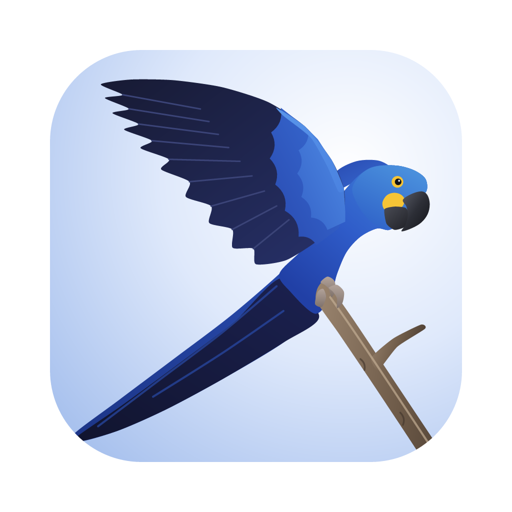
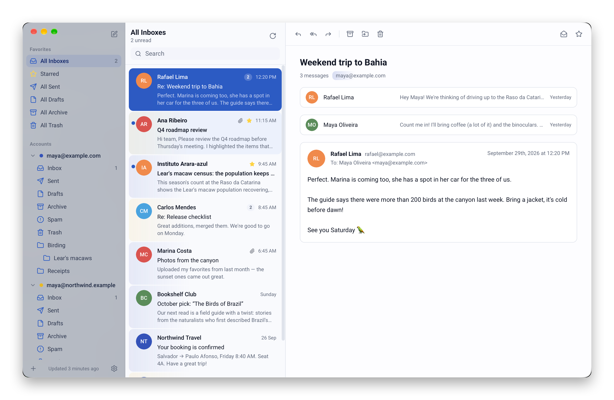

<p align="center">
  
</p>

<h1 align="center">Leari</h1>

<p align="center">A minimalistic, open source, multi-account mail client that lives in your menu bar.</p>

<p align="center">
  <a href="https://github.com/leari-mail/leari/actions/workflows/ci.yml"></a>
  <a href="https://github.com/leari-mail/leari/releases"></a>
</p>

> [!WARNING]
> Leari is in **alpha**. Expect rough edges and breaking changes between versions.

---

**Leari** is named after the Lear's macaw (_Anodorhynchus leari_), an indigo-blue macaw
found only in Bahia, Brazil. Another bird is also behind it: Leari is a homage to
[Sparrow](<https://en.wikipedia.org/wiki/Sparrow_(email_client)>), the minimalist Mac mail
client that inspired its look and feel.
The macaw's cobalt plumage and yellow eye-ring are the basis of Leari's colors and icon.

<p align="center">
  <picture>
    <source media="(prefers-color-scheme: dark)" srcset="docs/screenshots/leari-dark.png" />
    
  </picture>
</p>

## Features

- **Multi-account:** Google / Workspace, Outlook / Microsoft 365, and any IMAP or POP3 server
- **Unified folders:** All Inboxes, Starred, Sent, Drafts, Archive and Trash across every account
- **Menu bar / tray app:** no Dock icon by default (optional in Settings); closing the window hides it
- **Three-pane layout:** resizable sidebar, message list and reader
- **Mail management:** select several conversations (`⌘`-click, `⇧`-click, `⌘A`) to archive, move,
  delete, mark or star them together; drag them onto a folder; right-click for all actions,
  `⌫` to delete
- **Folders:** create, rename, nest and delete folders; empty Trash and Spam; mark a folder as read
- **Keyboard friendly:** `↑`/`↓` or `j`/`k` to navigate (`⇧` to extend the selection), `⌘N` to
  compose, `⌘,` for settings
- **Light and dark themes**, following the system by default
- **Languages:** English and Português (Brasil)

### Roadmap

**Done**

- [x] App shell: tray / menu bar, window behavior, single instance
- [x] Local database with migrations
- [x] Mail UI: sidebar, message list, reader, composer, settings
- [x] Add account flow (provider presets for Google and Microsoft)
- [x] IMAP sync (Rust): folders, messages, flags, expunges; local changes pushed back
- [x] Credentials in the OS keychain
- [x] OAuth 2 sign-in for Google and Microsoft
- [x] SMTP sending (password and OAuth), saved to Sent
- [x] Attachments (open, save, attach, forward) and embedded images
- [x] New mail notifications and unread count in the menu bar
- [x] POP3 download (mail left on the server; everything else local)
- [x] Instant new mail (IMAP IDLE)
- [x] Threaded conversations

**Enterprise**

- [ ] Microsoft Graph backend for Microsoft 365: works when admins disable IMAP / SMTP AUTH,
      native folders, categories and server-side search
- [ ] Microsoft Publisher Verification, so users in managed tenants can consent without an admin
- [ ] Clear guidance when a tenant requires admin approval (with an admin consent link)
- [ ] Google OAuth verification (restricted Gmail scope) for sign-in beyond 100 test users
- [ ] Sovereign clouds (GCC High, DoD, 21Vianet)

Not planned for now: Exchange Server on-premises beyond IMAP with a password, and Kerberos /
NTLM / client-certificate authentication.

## Install

Download the latest build from [Releases](https://github.com/leari-mail/leari/releases):

- **macOS** (Apple Silicon and Intel): `Leari_<version>_universal.dmg`
- **Windows**: `Leari_<version>_x64-setup.exe`

Builds are not notarized by Apple / signed by Microsoft yet:

- **macOS:** after moving Leari to Applications, run
  `xattr -dr com.apple.quarantine /Applications/Leari.app`, or allow it in
  System Settings → Privacy & Security.
- **Windows:** in the SmartScreen prompt, choose **More info** → **Run anyway**.

## Platform notes

| Platform | Where Leari lives              | Notes                                      |
| -------- | ------------------------------ | ------------------------------------------ |
| macOS    | Menu bar (Dock icon optional)  | Translucent sidebar, hidden title bar      |
| Windows  | System tray (taskbar optional) |                                            |
| Linux    | System tray                    | Clicking the tray icon only opens its menu |

Click the tray icon to show or hide the window; hold it (or right-click) for the menu, which has
**Open**, **New Message** and **Quit**. **Settings → Show Leari in the Dock / taskbar** also shows
it as a regular app.

## Stack

| Layer    | Tech                                                                  |
| -------- | --------------------------------------------------------------------- |
| Shell    | [Tauri 2](https://tauri.app) (Rust)                                   |
| UI       | React 19, TypeScript, Tailwind CSS 4, shadcn/ui, Lucide icons, Roboto |
| State    | TanStack Query (data), Zustand (UI state)                             |
| Database | SQLite via `tauri-plugin-sql` + Drizzle ORM                           |
| i18n     | i18next / react-i18next                                               |

## Development

Prerequisites: [Tauri prerequisites](https://tauri.app/start/prerequisites/), Node 24+, pnpm 10+,
Rust (stable).

```sh
pnpm install
pnpm app            # run the desktop app (tauri dev)
```

In development, an empty database is seeded with demo accounts and messages.

**macOS Keychain prompts in development.** macOS ties "Always Allow" to an app's code
signature, and every rebuild is a new binary. Dev builds are therefore signed with a local
"leari Development" identity, created automatically on the first `pnpm app` (see
`scripts/dev-run.sh`), so they keep the same signature. Choose **Always Allow** once and it sticks.

| Script                | What it does                                                      |
| --------------------- | ----------------------------------------------------------------- |
| `pnpm app`            | Run the app with hot reload                                       |
| `pnpm tauri build`    | Build installers locally                                          |
| `pnpm check`          | Everything CI checks: types, lint, formatting, clippy, Rust tests |
| `pnpm typecheck`      | TypeScript check                                                  |
| `pnpm lint`           | ESLint (`pnpm lint:fix` to autofix, `pnpm lint:rust` for clippy)  |
| `pnpm format`         | Prettier and rustfmt (`pnpm format:check` to verify only)         |
| `pnpm test`           | Frontend unit tests (Vitest)                                      |
| `pnpm test:rust`      | Rust unit tests                                                   |
| `pnpm db:generate`    | Generate a migration after changing `src/db/schema`               |
| `pnpm ui:add <name>`  | Add a shadcn/ui component, split into one file per component      |
| `pnpm release <bump>` | Cut a release (see [Releasing](#releasing))                       |
| `pnpm screenshots`    | macOS: regenerate the README screenshots from demo data           |

A pre-commit hook (husky + lint-staged) lints and formats staged files.

### OAuth setup (Google and Microsoft sign-in)

Google and Microsoft accounts sign in with OAuth. Leari opens the provider's page in the browser
and receives the result on a local loopback address (PKCE, RFC 8252). Builds need the OAuth
client ids of the project: copy `.env.example` to `.env.local` (git-ignored) and fill it in.
Release builds read the same names from the repository's Actions secrets. Without them, those
two options explain that sign-in isn't available and point to IMAP with an app password.

**Google** ([Google Cloud Console](https://console.cloud.google.com/)):

1. Create a project, enable the **Gmail API**.
2. **OAuth consent screen**: External; add the scope `https://mail.google.com/`.
3. **Credentials → Create credentials → OAuth client ID → Desktop app**. Put the client id and
   secret in `LEARI_GOOGLE_CLIENT_ID` / `LEARI_GOOGLE_CLIENT_SECRET` (for desktop apps the
   secret is not confidential).

> [!NOTE]
> `https://mail.google.com/` is a **restricted** scope. While the consent screen is in
> _Testing_, only listed test users (up to 100) can sign in and their sign-ins expire after
> 7 days. Opening it to everyone requires Google's verification and a yearly security assessment.

**Microsoft** ([Microsoft Entra admin center](https://entra.microsoft.com/) → App registrations):

1. **New registration**: accounts in any organizational directory **and** personal Microsoft
   accounts.
2. **Authentication → Add a platform → Mobile and desktop applications**, redirect URI
   `http://localhost`; set **Allow public client flows** to _Yes_.
3. **API permissions → Add → APIs my organization uses → Office 365 Exchange Online →
   Delegated**: `IMAP.AccessAsUser.All`, `SMTP.Send` (plus `offline_access`, `openid`,
   `email`, `profile` from Microsoft Graph).
4. Put the **Application (client) ID** in `LEARI_MICROSOFT_CLIENT_ID`. No secret is needed.

### Testing IMAP sync locally

The sync engine has an end-to-end test that runs against a disposable IMAP server.
[GreenMail](https://greenmail-mail-test.github.io/greenmail/) works well (needs Java):

```sh
java -Dgreenmail.setup.test.all -Dgreenmail.users=leari:secret@localhost \
  -jar greenmail-standalone.jar

LEARI_TEST_IMAP=127.0.0.1:3143 LEARI_TEST_SMTP=127.0.0.1:3025 LEARI_TEST_POP3=127.0.0.1:3110 \
LEARI_TEST_USER=leari LEARI_TEST_PASS=secret \
  cargo test --manifest-path src-tauri/Cargo.toml -- --ignored
```

To try it in the app, add an **IMAP** account with server `127.0.0.1`, port `3143`,
security **None**, username `leari` and password `secret`.

## How sync works

- The Rust engine (`src-tauri/src/mail`, `src-tauri/src/sync`) syncs every account on start
  and every 5 minutes, and keeps an IMAP IDLE connection per account so new mail arrives
  instantly. It opens the same SQLite file as the UI, in WAL mode.
- Each sync pushes queued local changes first, then reconciles folders, updates flags,
  removes expunged messages and downloads new ones (the latest 200 per folder on first sync).
- Changes made in the UI (read, star, archive, delete) are applied locally right away and
  queued in `pending_operations`, so they are never overwritten by a sync and survive being offline.
- The engine emits `sync://status` and `sync://changed` events, and the UI refreshes as data arrives.

## Project structure

```
src/
  app/          App root, providers, query client
  components/   One folder per category, one component per file, index.ts barrels
    ui/         shadcn/ui primitives (split by scripts/split-ui.ts)
  db/           Drizzle schema, migrations, client, dev seed
  hooks/        TanStack Query hooks and app-level hooks
  i18n/         i18next setup and locales
  lib/          Pure helpers
  models/       Domain types
  services/     Data access (Drizzle queries)
  stores/       Zustand stores
  styles/       Tailwind entry and theme tokens
src-tauri/      Rust: tray, window behavior, sync engine (mail/, sync/), keychain
assets/brand/   Icon sources (gen_icon.py generates the SVGs)
scripts/        Tooling (shadcn splitter)
```

## Releasing

Versions follow [Semantic Versioning](https://semver.org/) with `alpha`, `beta` and `rc`
pre-release channels. `package.json` holds the version (Tauri reads it from there).

1. Make sure every change is listed under **Unreleased** in [CHANGELOG.md](CHANGELOG.md).
2. On an up-to-date `main`, run one of:

   ```sh
   pnpm release alpha    # 0.1.0-alpha.1 → 0.1.0-alpha.2
   pnpm release beta     # 0.1.0-alpha.2 → 0.1.0-beta.1
   pnpm release stable   # 0.1.0-rc.1    → 0.1.0
   pnpm release minor    # 0.1.0         → 0.2.0
   ```

   The script bumps `package.json`, `Cargo.toml` and `Cargo.lock`, dates the changelog,
   commits and tags. Add `--dry-run` to preview.

3. `git push --follow-tags`. The [release workflow](.github/workflows/release.yml) builds
   macOS (universal) and Windows installers and publishes a GitHub release with the changelog
   notes. Versions with a pre-release suffix are marked as pre-releases.

## Contributing

Conventions (see also [CLAUDE.md](CLAUDE.md)):

- **One component per `.tsx` file**, enforced by ESLint (`react/no-multi-comp`).
- **Group by category.** Components live in `src/components/<category>/`, each folder with an
  `index.ts` barrel. The same goes for hooks, stores and services.
- **Use path aliases for imports:** `@components/<category>`, `@ui`, `@hooks`, `@stores`,
  `@services`, `@db`, `@models`, `@lib`, `@i18n`, `@app`, `@assets/*`. They are defined in
  `tsconfig.json`.
- **Components never query the database directly.** They use TanStack Query hooks from `@hooks`,
  which call `@services`.
- **Every user-facing string goes through i18next**, with keys added to every locale.
- **Use theme tokens** from `src/styles/globals.css` instead of raw colors.
- Imports are sorted automatically (`pnpm lint:fix`): packages, then aliases, then relative.
- Add a line to **Unreleased** in [CHANGELOG.md](CHANGELOG.md) for user-facing changes.
- Run `pnpm check` before opening a pull request. CI runs the same checks, plus the IMAP
  end-to-end test.

### Adding a language

1. Copy `src/i18n/locales/en` to `src/i18n/locales/<code>` and translate the JSON files.
2. Register it in `src/i18n/resources.ts` and `src/i18n/languages.ts`.
3. Add its `date-fns` locale in `src/lib/format.ts`.

## License

[MIT](LICENSE)
